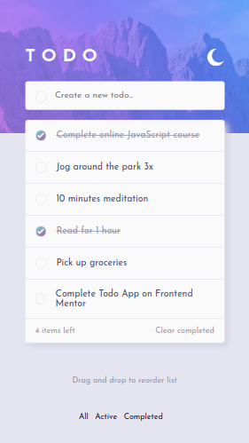

# Frontend Mentor - Todo app solution

This is a solution to the [Todo app challenge on Frontend Mentor](https://www.frontendmentor.io/challenges/todo-app-Su1_KokOW). Frontend Mentor challenges help you improve your coding skills by building realistic projects. 

## Table of contents

- [Overview](#overview)
  - [The challenge](#the-challenge)
  - [Screenshot](#screenshot)
  - [Links](#links)
- [My process](#my-process)
  - [Built with](#built-with)
  - [What I learned](#what-i-learned)
  - [Continued development](#continued-development)
  - [Useful resources](#useful-resources)
- [Author](#author)
- [Acknowledgments](#acknowledgments)

## Overview

### The challenge

Users should be able to:

- View the optimal layout for the app depending on their device's screen size
- See hover states for all interactive elements on the page
- Add new todos to the list
- Mark todos as complete
- Delete todos from the list
- Filter by all/active/complete todos
- Clear all completed todos
- Toggle light and dark mode
- **Bonus**: Drag and drop to reorder items on the list

### Screenshot

### Links

- Solution URL: [Todo app challenge](https://github.com/ymbeltran/todo-app.git)
- Live Site URL: [GitHub Pages](https://ymbeltran.github.io/todo-app/)

## My process

### Built with

- [React](https://reactjs.org/) - JS library
- React Context. React useState. 
- Webpack
- Babel
- SASS & BEM
- Mobile-first workflow

### What I learned

I learned to work with Webpack. I learned to use React Context (provider, consumer), React useState and handle the local storage. I also explored the use of BEM methodology.

### Continued development

For future projects I would like to practice writing comments while writing code because this time I forgot to do it.

### Useful resources

- [react-beautiful-dnd](https://github.com/atlassian/react-beautiful-dnd) - This helped me to add the drag and drop feature. I loved this library.
- [How to add DRAG and DROP in React using react-beautiful-dnd | Tutorial [english subtitles]](https://www.youtube.com/watch?v=bZsMWorjtFI) - I followed this tutorial to use the library.

## Author

- Website - [Yess](https://yesse.co)
- Frontend Mentor - [@ymbeltran](https://www.frontendmentor.io/profile/ymbeltran)
- Twitter - [@ymbeltran](https://www.twitter.com/ymbeltran)

## Acknowledgments

This might sound silly but I want to thank a friend that presented me with this challenge and encourage me to do it. I'm also grateful for Platzi where I've learned a lot.